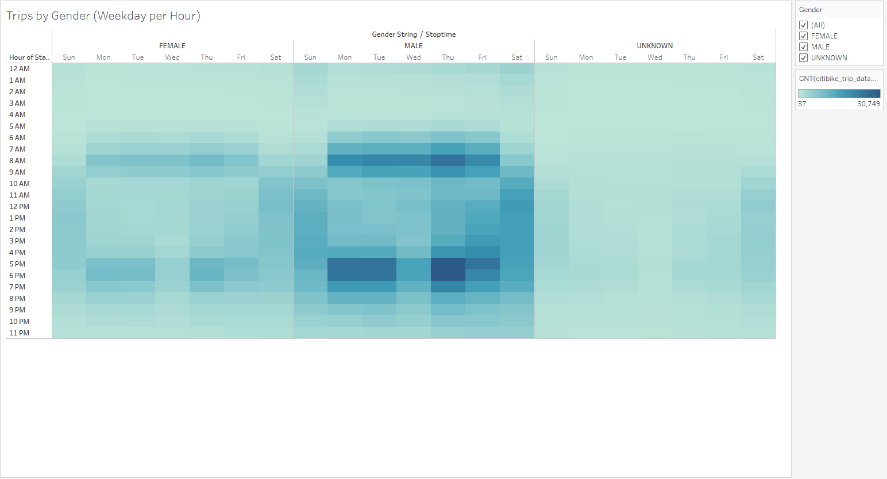

# bikesharing
Analysis of the Citi Bike system in NYC

## Project Overview
Using Tableau, data from NYC citibike was analyzed for the month of August, 2018. The initial goal was to determine viability for a similar project in Des Moines, IA. 

## Resources
- Data Source: 201908-citibike-tripdata
- Software: Tableau Public Desktop, Jupyter Notebook, Python 3.7.9

## Overview
To view this information in its intended format, visit:[NYC Citi Bike Tableau Story](https://public.tableau.com/profile/brian.william.forth#!/vizhome/NYCCitiBike_16169005974820/NYCCitibikeStory?publish=yes)

## Results
Looking at the relative usage statistics of the citibike stations in NYC, a handful of stations have the clear majority of bike pickups.

A similar makeup of stations have the majority of dropoffs.

A single station leads in both categories, located at 40.7519, -73.9777. If you look at these coordinates on the Earth, you will see what location is so central to these bicycle trips...

...Grand Central station: a hub of public transit throughout the city and surrounding area. Des Moines has a bus system that connects it to nearby cities. If that system has significant hubs, possibly bike stations could be set up for commuters coming in on the buses.

So, the plurality of people using citibikes are coming from and going to Grand Central.
How long does the typical user actually ride, though? Is it a long ride, or just a quick hop from one station to the next?

Short rides, with many rides lasting 5 minutes or less. But does this vary by gender?

Not appreciably, though riders of unknown gender have a much wider peak, ranging from about 7-27 minutes. So when do these rides take place?

These bikes are used, first and foremost, by commuters. That's good news for the prospect of starting a branch in Des Moines, which is significantly less reliant on tourists than NYC is. Perhaps this is impacted by rider gender?

Not appreciably, other than male riders ride in much larger numbers in general then female riders. But what about the weekends? The bikes are certainly in use more during the weekends than during any time OTHER than M-F commutes. Maybe we should look at the use differences between rider types?

It seems that short term customers use the bikes far more during the weekends, while subscribers tend to use the bikes Monday to Friday (for commuting, as we've already determined).

So, we've answered some questions, but there are more still out there. What hours are the bikes used by different rider types? How long do the different rider types typically use the bikes? And, though this information is unavailable in the data source, how much revenue is brought in from each rider type? Des Moines looks like a potentially good candidate for citi bike, but if the system is reliant on short-term customers subsidizing subscribers, then it may not work.
